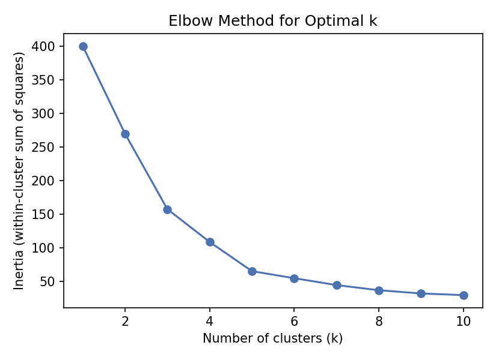
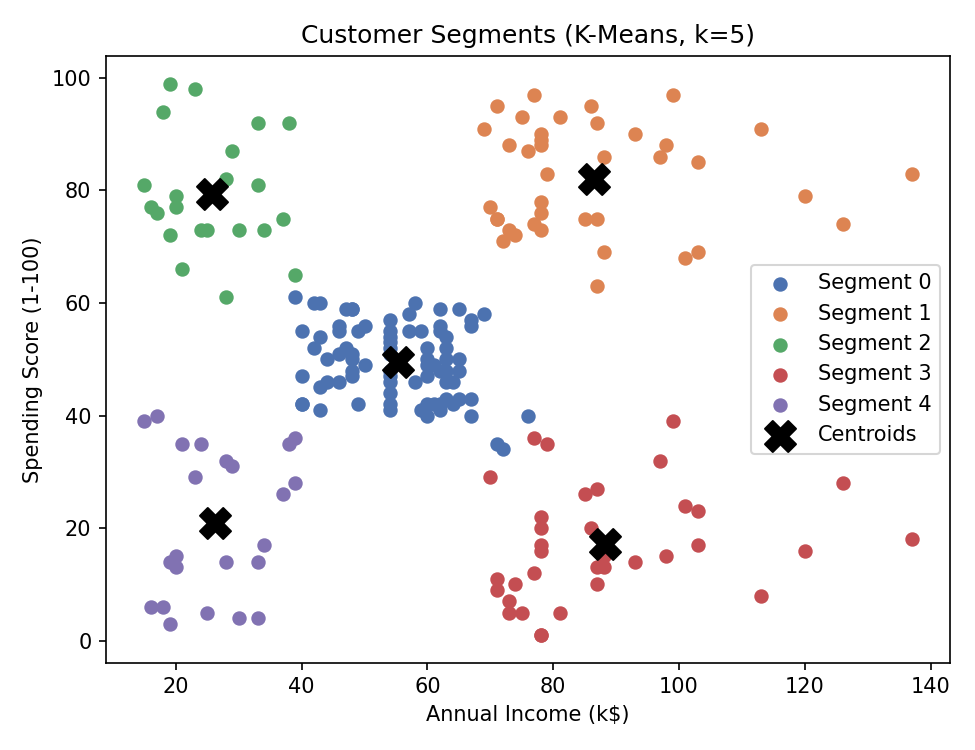

# Mall Customer Segmentation with K-Means Clustering

Segmenting mall customers into distinct groups using unsupervised
learning, built to demonstrate the clustering workflow: scale features →
choose K → fit → visualize → interpret business meaning.

## Problem
Given customer age, annual income, and spending score (no labels — this
is unsupervised), find natural groupings a business could target with
different marketing strategies.

## Approach
1. Selected `AnnualIncome` and `SpendingScore` as clustering features.
2. Standardized both (K-Means uses Euclidean distance, so features on
   different scales would otherwise distort the clusters).
3. Used the **elbow method** across k=1 to 10 to find the natural
   number of clusters.
4. Fit the final K-Means model and visualized the resulting segments.

## Results
The elbow method clearly pointed to **k = 5**. The resulting segments:

| Segment | Age | Income | Spending | Count | Interpretation |
|---|---|---|---|---|---|
| 0 | 42.7 | $55.3k | 49.5 | 81 | Average customer |
| 1 | 32.7 | $86.5k | 82.1 | 39 | High income, high spending — most valuable group |
| 2 | 25.3 | $25.7k | 79.4 | 22 | Low income, high spending — price-sensitive but engaged |
| 3 | 41.1 | $88.2k | 17.1 | 35 | High income, low spending — untapped potential |
| 4 | 45.2 | $26.3k | 20.9 | 23 | Low income, low spending — low marketing priority |

**Business takeaway:** Segment 3 (high income, low spending) represents
the biggest untapped opportunity — re-engagement campaigns targeted at
this group could have high ROI. Segment 1 is already the most valuable
and should be prioritized for loyalty perks.

## Files
- `Customer_Segmentation_KMeans.ipynb` — full notebook with narrative, code, and outputs
- `customer_segmentation.py` — the same analysis as a plain Python script
- `Mall_Customers.csv` — the dataset (200 customers)
- `elbow_method.png`, `customer_segments.png` — charts

## Tools
Python, Pandas, NumPy, Matplotlib, scikit-learn

## Possible extensions
- Add `Age` as a third clustering dimension (would need 3D visualization
  or PCA to plot)
- Compare against hierarchical clustering or DBSCAN
- Turn the segment profiles into concrete marketing recommendations
